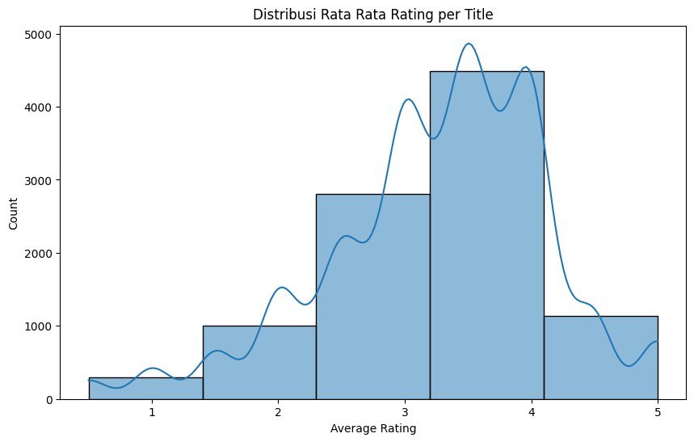
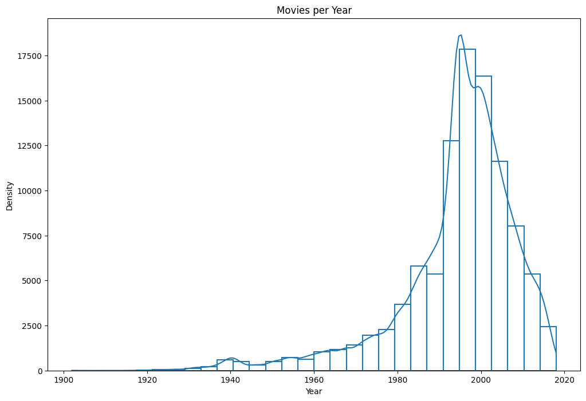
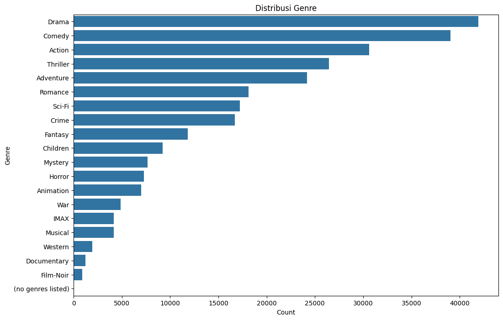
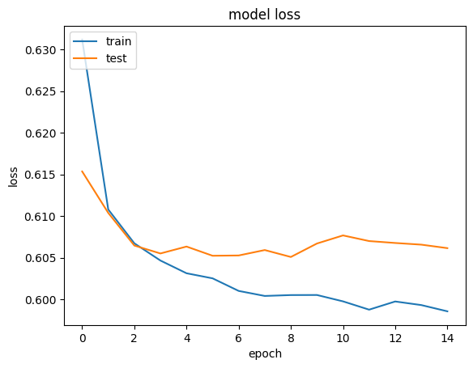

# Laporan Proyek Machine Learning - Kelvin Riyanto
# Project Overview
---
Dalam era modern ini, platform **Streaming** berkembang dengan sangat pesat, yang di mulai dari *Youtube*, hingga platform streaming dengan skema berlangganan seperti *Hulu*, *Netflix*, *Disney Plus*, dan *Amazon Prime*, di Indonesia sendiri pun, tidak ketinggalan dengan hadirnya platform seperti *Vidio*.

Platform-platform tersebut, terutama yang menggunakan skema berlangganan, berlomba-lomba menarik customer yang mereka berikan, dengan data yang dirilis oleh *Statista*, hingga pada tahun 2025, platform streaming berlangganan memiliki *market share* sebagai berikut:


> Sumber diperoleh dari [Evoca.tv](https://evoca.tv/streaming-service-market-share/)

Dengan ini, akan dibutukan sebuah sistem untuk merekomendasikan produk kepada user, dengan harapan user itu dapat tertarik untuk terus berada di model bisnis yang telah ditetapkan, maka dari itu dibuatlah **Sistem Rekomendasi.**

**Sistem rekomendasi** adalah sebuah algoritma kecerdasan buatan, yang umumnya di hubungkan dengan pembelajaran mesin, yang menggunakan **Big Data** untuk menyarankan atau merekomendasikan sebuah produk tambahan untuk user. Ini dapat berbasis pada berbagai kriteria, termasuk pembelian terdahulu, riwayat pencarian, informasi demografi, dan faktor lain[1].

**Sistem Rekomendasi** sendiri memiliki 2 pendekatan yang berbeda, yakni *Collaborative Filtering* dan *Content-Based Filtering*, terdapat juga pendekatan lainnya, yaitu *Hybrid Recommendation System* yang menggabungkan kelebihan daripada kedua algoritma yang telah disebutkan sebelumnya. Pada *Collaborative Learning*, algoritma berfokus pada kesamaan preferensi antar satu user dan user yang lain. Berbeda pada *Content-Based Learning* yang menggunakan atribut atau fitur dari sebuah barang untuk merekomendasikan barang lainnya yang memiliki kesamaan dengan barang yang disukai oleh pegguna[1].

Proyek ini akan menggunakan dataset yang di dapatkan melalui *kaggle* untuk melakukan percobaan dalam menerapkan sistem *Collaborative Filtering* dan *Content-Based Filtering*. Dataset yang digunakan adalah dataset yang terdiri dari rating user, dan genre terhadap film-film yang dapat ditonton. Data ini akan menjadi landasan dalam membangun sistem *Collaborative Learning* dan *Content-Based Filtering*. 

Proyek ini bertujuan untuk melakukan pembangunan dan penerapan sederhana Sistem Rekomendasi dengan pendekatan *Collaborative Learning* dan *Content-Based Filtering* dengan menggunakan dataset film dari periode sekitar tahun 1990-an hingga pada tahun 2010-an sebagai kasus.

# Business Understanding
---
## Problem Statements
Masalah yang ingin diselesaikan dirumuskan sebagai berikut:
1. Bagaimana cara membangun sistem rekomendasi berbasis Collaborative Filtering dan Content-Based Filtering untuk memberikan rekomendasi film yang relevan kepada pengguna berdasarkan data dari pengguna dan juga film?
2. Bagaimana mengoptimalkan akurasi rekomendasi menggunakan metode kesamaan antar preferensi user dan film?
## Goals
Adapun tujuan dari penelitian sebagai berikut:
1. Membangun sistem rekomendasi sederhana berbasis Collaborative Filtering dan Content-Based Filtering yang mampu menyarankan film berdasarkan kesamaan preferensi antar pengguna.
2. Meningkatkan akurasi rekomendasi dengan mengimplementasikan metode pengukuran kesamaan antar pengguna, seperti Cosine Similarity atau Pearson Correlation, atau dengan memanfaatkan deep learning agar dapat menghadirkan sebuah sistem rekomendasi yang lebih komprehensif.
## Solution
Solusi yang akan diajukan adalah sebagai berikut:
1. Menerapkan algoritma Collaborative Filtering dan Content-Based Filtering menggunakan dataset film yang tersedia dari Kaggle.
2. Menggunakan metode perhitungan kesamaan antar pengguna (seperti Cosine Similarity atau Pearson Correlation) untuk membangun rekomendasi berbasis objek yang akurat, dan juga memanfaatkan deep learning untuk rekomendasi berdasar pada user lain.
# Data Understanding
---


Dataset yang meliputi dua file, yaitu `movies.csv` dan `ratings.csv`.
Masing masing memiliki jumlah data yang berbeda, dimana terdapat 9742 baris pada dataset `movies` dan 100836 baris pada dataset `ratings`

| Movies                 | Ratings                            |
| ---------------------- | ---------------------------------- |
| 9742 rows              | 100836 rows                        |
| movieId, title, genres | userId, movieId, rating, timestamp |
## Fitur Movies

| Fitur   | Penjelasan                     | tipe data |
| ------- | ------------------------------ | --------- |
| movieId | id unik dari film.             | int64     |
| title   | judul dari film.               | object    |
| genre   | genre atau kategori dari film. | object    |
## Fitur Ratings

| Fitur     | Penjelasan                                                                | tipe data |
| --------- | ------------------------------------------------------------------------- | --------- |
| userId    | id unik dari user.                                                        | int64     |
| movieId   | id unik dari film.                                                        | int64     |
| rating    | rating yang diberikan kepada user terhadap film yang sesuai pada movieId. | float64   |
| timestamp | data yang berupa kapan data tersebut direkam.                             | int64     |

## Deskripsi data rating

| idx   | rating        |
| ----- | ------------- |
| count | 100836.000000 |
| mean  | 3.501557      |
| std   | 1.042529      |
| min   | 0.500000      |
| 25%   | 3.000000      |
| 50%   | 3.500000      |
| 75%   | 4.000000      |
| max   | 5.000000      |


*Gambar Distribusi Rating per judul film*
Bila dibandingkan dengan data yang didapat melalui deskripsi data dan visualisasi data, dapat disimpulkan bahwa rata-rata data disini didominasi oleh rating berkisar 3.5 hingga 5.

| idx   | title                                     | rating | count |
| ----- | ----------------------------------------- | ------ | ----- |
| 23896 | Shawshank Redemption, The (1994)          | 5.0    | 153   |
| 21524 | Pulp Fiction (1994)                       | 5.0    | 123   |
| 9956  | Forrest Gump (1994)                       | 5.0    | 116   |
| 17188 | Matrix, The (1999)                        | 5.0    | 109   |
| 25356 | Star Wars: Episode IV - A New Hope (1977) | 5.0    | 104   |
| 24184 | Silence of the Lambs, The (1991)          | 4.0    | 97    |
| 14570 | Jurassic Park (1993)                      | 4.0    | 97    |
| 9954  | Forrest Gump (1994)                       | 4.0    | 94    |
| 23327 | Schindler's List (1993)                   | 5.0    | 92    |
| 24186 | Silence of the Lambs, The (1991)          | 5.0    | 92    |


*Distribusi keluaran film pertahun*
Dari visualisasi ini juga didapatkan, film yang di muat dlaam dataset merupakan film dari tahun 1900-an hingga pada tahun 2018.



*Distribusi Genre Film*
Dataset yang didapatkan didominasi dengan genre Drama, Comedy, Action, Thriller, sehingga kita dapat mengekspektasikan bahwa kita akan lebih sering mendapatkan rekomendasi dengan genre tersebut.

# Data Preparation
---

Tahapan ini berguna untuk mempersiapkan data sebelum di feed ke dalam model. Data Preparation bertujuan untuk menghasilkan data yang lebih bersih, dan menentukan data pipeline yang dapat disesuaikan dengan kebutuhan model. Langkah yang dilakukan dalam Data Preparation adalah sebagia berikut:
1. Menggabungkan data rating dan film menjadi satu. Merging ini dilakukan berdasarkan pada identifikasi unik film (movieId).
2. Melakukan eliminasi terhadap data kosong dan duplikat. Data yang memiliki nilai NaN ataupun terduplikasi akan di hapus agar menghindari model yang menangkap noise dalam data.
3. Encode untuk content-based filtering, dengan melakukan embedding (tfidf) yang kemudian dilakukan perhitungan jarak kosinus terhadap setiap nilai genre. Ini dilakukan untuk mencari korelasi antar produk yang kurang lebih mirip, nilai korelasi ini akan dijadikan basis dalam memberikan rekomendasi.
4. Melakukan encode data user dan film untuk collaborative learning, yang kemudian dilakukan juga scaling menggunakan minmax scaling.
5. Melakukan pembagian data dengan rasio 90/10.
Tahap ini dilakukan agar untuk mendapatkan system atau model dengan generalisasi yang lebih baik, dan juga memastikan data yang bersih dan rata.
# Modeling and Result
---
## Content-Based Filtering
Model pada content-based filtering menggunakan tfidf untuk melakukan embedding ada genre film, yang kemudian setiap kemiripannya akan di hitung menggunakan cosine similarity.
Metode ini akan menghasilkan hal berikut:
Dengan input **id film 123** dengan film:
```
 Untouchables, The (1987) Action|Crime|Drama
```
menghasilkan rekomendasi:

| idx  | movie_id | title                                                  | genres                                  | rating | similarity Score |
|------|----------|--------------------------------------------------------|------------------------------------------|--------|------------------|
| 64064| 31658    | Howl's Moving Castle (Hauru no ugoku shiro) (2004)    | Adventure\|Animation\|Fantasy\|Romance   | 4.0    | 1.0              |
| 64065| 2064     | Roger & Me (1989)                                      | Documentary                              | 5.0    | 1.0              |
| 64034| 2421     | Karate Kid, Part II, The (1986)                        | Action\|Adventure\|Drama                 | 2.0    | 1.0              |
| 64035| 92535    | Louis C.K.: Live at the Beacon Theater (2011)         | Comedy                                   | 4.5    | 1.0              |
System ini memiliki maksimal rekomendasi sebanyak 6, tetapi disini kita hanya mendapat 4 rekomendasi.
### Pertimbangan
#### Kelebihan:
- Cepat untuk diimplementasi.
- Sistem ini dapat bekerja meskipun dengan data preferensi user yang minimal.
- Struktur dari pipeline data yang lebih sederhana.
#### Kekurangan:
- Sifat dari sistem ini yang tidak mempedulikan preferensi user dan hanya mempedulikan genre, berkemungkinan untuk terjadinya rekomendasi yang kurang beragam.
- Perhitungan nilai cosinus yang menjadi lebih lambat seiring bertambahnya data, ini perlu diperhatikan dalam tahap pemeliharaan.
## Collaborative Filtering
Disini, saya akan memanfaatkan custom layer, dengan struktur berikut:
```
class RecommenderNet(keras.Model):

    def __init__(self, num_users, num_movies, embedding_size, **kwargs):

        super().__init__(**kwargs)

        self.num_users = num_users #berapa banyak user?

        self.num_movies = num_movies #berapa banyak film?

        self.embedding_size = embedding_size #Seberapa besar embedding akan dilakukan?

        self.user_embedding = layers.Embedding(

            num_users,

            embedding_size,

            embeddings_initializer="he_normal",

            embeddings_regularizer=keras.regularizers.l2(1e-6),

        ) #melakukan embedding terhadap user menjadi nilai vector

        self.user_bias = layers.Embedding(num_users, 1) #menambah bias untuk nilai user

        self.movie_embedding = layers.Embedding(

            num_movies,

            embedding_size,

            embeddings_initializer="he_normal",

            embeddings_regularizer=keras.regularizers.l2(1e-6),

        ) #melakukan embedding terhadap film menjadi nilai vektor

        self.movie_bias = layers.Embedding(num_movies, 1) #menentukan bias untuk film

  

    def call(self, inputs):

        user_vector = self.user_embedding(inputs[:, 0])

        user_bias = self.user_bias(inputs[:, 0])

        movie_vector = self.movie_embedding(inputs[:, 1])

        movie_bias = self.movie_bias(inputs[:, 1])

        # Mencari dot products melalui perkalian matriks

        dot_user_movie = ops.tensordot(user_vector, movie_vector, 2)

        # kemudian menambah bias

        x = dot_user_movie + user_bias + movie_bias

        # Hitung nilai aktivasinya

        return ops.nn.sigmoid(x)
```
dengna inisialisasi hyperparameter sebagai berikut:
```
model = RecommenderNet(num_users, num_movies, 50)

model.compile(

    loss=keras.losses.BinaryCrossentropy(),

    optimizer=keras.optimizers.Adam(learning_rate=1e-3),

)
```
Model akan di train dengan melalui 15 epochs, 32 batch size.
Model ini menghasilkan rekomendasi sebagai berikut:
**Input id**:
userid: 159
5 sample yang telah ditonton oleh user 159 dengan bintang diatas 4

| movie_idx | movieId | title                                             | genres                                 | rate | score |
| --------- | ------- | ------------------------------------------------- | -------------------------------------- | ---- | ----- |
| 64064     | 31658   | Howl's Moving Castle (Hauru no ugoku shiro) (2... | Adventure\|Animation\|Fantasy\|Romance | 4.0  | 1.0   |
| 64065     | 2064    | Roger & Me (1989)                                 | Documentary                            | 5.0  | 1.0   |
| 64034     | 2421    | Karate Kid, Part II, The (1986)                   | Action\|Adventure\|Drama               | 2.0  | 1.0   |
| 64035     | 92535   | Louis C.K.: Live at the Beacon Theater (2011)     | Comedy                                 | 4.5  | 1.0   |
| 64036     | 2011    | Back to the Future Part II (1989)                 | Adventure\|Comedy\|Sci-Fi              | 3.5  | 1.0   |
Memiliki hasil sebagai berikut:
Top 10 movie recommendations
--------------------------------
Hoop Dreams (1994) : Documentary
Secrets & Lies (1996) : Drama
One Flew Over the Cuckoo's Nest (1975) : Drama
Ran (1985) : Drama|War
Cool Hand Luke (1967) : Drama
Lifeboat (1944) : Drama|War
Celebration, The (Festen) (1998) : Drama
Guess Who's Coming to Dinner (1967) : Drama
Trial, The (Procès, Le) (1962) : Drama
Three Billboards Outside Ebbing, Missouri (2017) : Crime|Drama
### Pertimbangan
#### Kelebihan:
- Collaborative Learning menggunakan deep learning memberikan hasil yang lebih beragam dan personal, jika dibandingkan dengan Conten-Based Filtering yang menggunakan TFIDF, mengingat deep learning yang memerhatikan rating user A ke user yang lain.
- Hasil yang akan menjadi lebih baik, seiring bertambahnya user base dan rating yang diberikan oleh para user.
#### Kekurangan:
- Membutuhkan data yang besar untuk menghasilkan rekomendasi yang relevan dan terpersonil.
- Nature dari deep learning yang memang akan membutuhkan kekuatan komputasi yang besar.
- Sifatnya yang blackbox sehingga menghasilkan sebuah model yang sulit untuk diprediksi keluarannya.
# Evaluation
---
## Content Based Filtering
Content-Based Filtering memiliki hasil yang dapat diukur menggunakan precision@k.
Presisi tersebut dapat dihasilkan melalui formula berikut:
$$
Presisi = \frac{rekomendasi\_relevan}{jumlah\_rekomendasi}
$$
System yang telah dibuat mendapatkan nilai 1.0. Sebuah nilai yang menandakan bahwa konten yang direkomendasikan adalah konten yang relevan,.
Tetapi perlu diperhatikan juga, apakah rekomendasi tersebut memang relevan dan cocok terhadap user yang mengkonsumsi suatu konten atau tidak, mengingat nilai presisinya yang sangat tinggi.
## Collaborative Filtering
Dalam collaborative filtering, akan digunakan Binary Cross Entropy untuk mengukur perbedaan antara dua label 0 dan 1, yang umumnya digunakan untuk klasifikasi biner.
Binary cross entropy dihitung dengan rumus berikut:
$$L=-\frac{N}{1}​∑_{i=1}^{N}​[yi​log(pi​)+(1−yi​)log(1−pi​)]$$
Dalam collaborative filtering, digunakan klasifikasi biner dikarenakan hanya untuk melihat apakah akun ini cocok dengan user target apa tidak.

Plot loss daripada model:

Bila diperhatikan, secara grafik, perbedaan loss pada train dan test memang terpauk jauh, tetapi ini dikarenakan **scale** dalam grafik yang melakukan zoom terlalu dalam.
Dari sini, dapat diperoleh 2 kesimpulan terhadap model:
1. Loss score yang cukup baik untuk validasi dan train, yaitu ada di sekitar 0.6.
2. Dengan score validasi yang konveregen terhadap train tidak memiliki nilai yang terlalu jauh, dapat disimpulkan bahwa model ini tidak mengalami overfitting.
# Daftar Referensi
---
[1] Recommendation System, Nvidia, https://www.nvidia.com/en-us/glossary/recommendation-system/. Diakses pada 9 Mei 2025.

